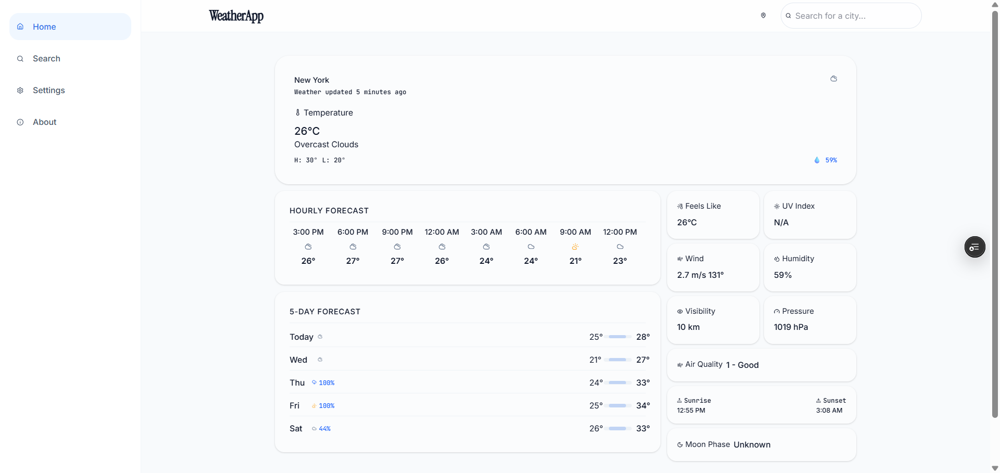
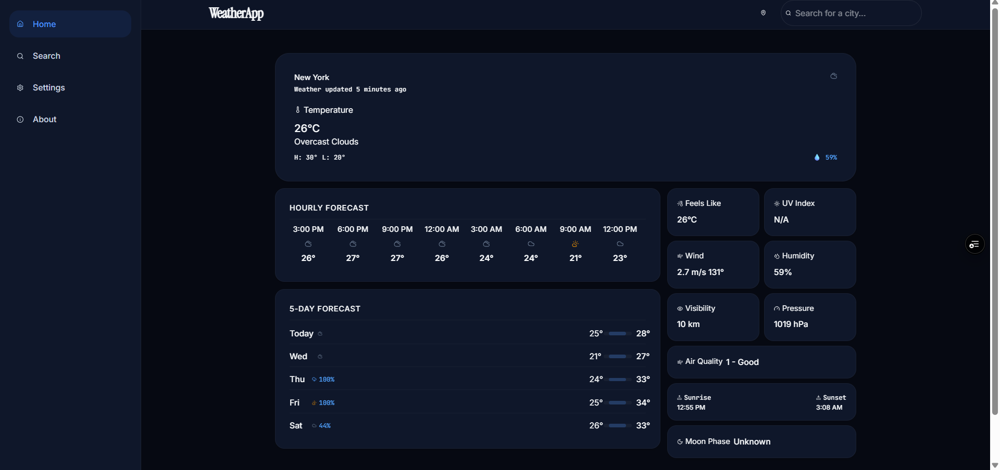
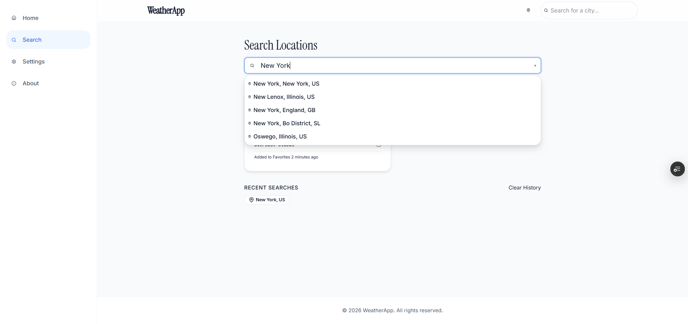
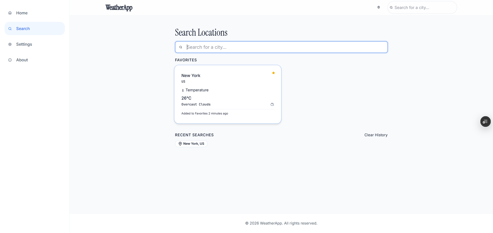
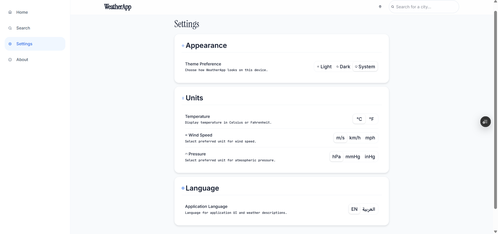
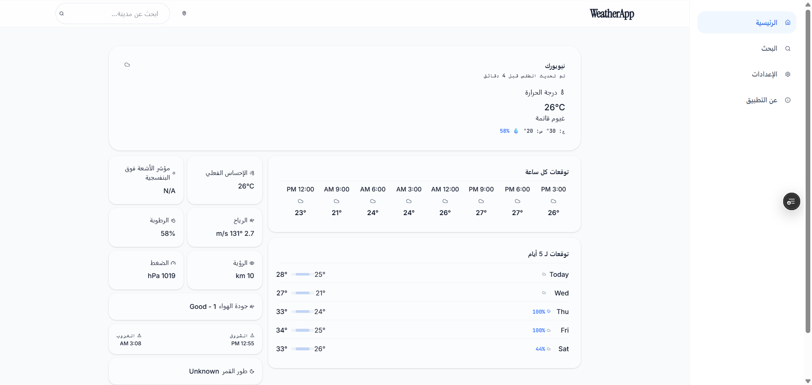

# WeatherApp


## Project Overview

A professional, modern, production-quality weather application designed to provide accurate forecasts and current conditions. This project is architected with clean design patterns, a feature-based structure, and standard enterprise conventions for scalability and maintainability.

## Features

- **Current Weather & Forecasts**: Real-time weather data and multi-day forecasts.
- **Search & Autocomplete**: Fast, debounced location search.
- **Favorites Management**: Save and manage favorite locations.
- **Geolocation Support**: Automatically fetch weather for your current location.
- **Personalization**: Dark/Light mode theme switching and unit preferences (°C / °F).
- **Localization**: Full internationalization (i18n) support, including RTL (Right-to-Left) layouts.
- **Offline Mode**: Robust caching and offline support using React Query.
- **Responsive Design**: Fully responsive UI tailored for mobile, tablet, and desktop.

## Screenshots

### Light & Dark Themes

<p align="center">
  
  
</p>

### Search & Favorites

<p align="center">
  
  
</p>

### Settings & Arabic (RTL)

<p align="center">
  
  
</p>

## Tech Stack

- **Core:** React 19, TypeScript, Vite
- **State & Data:** TanStack Query, Axios, React Router
- **Styling:** Tailwind CSS v4, Lucide React (Icons)
- **Testing:** Vitest, React Testing Library, Playwright
- **Quality & Formatting:** ESLint, Prettier, Husky, lint-staged

## Architecture Overview

The application follows a **feature-based architecture** emphasizing modularity, separation of concerns, and reusable patterns.

- **Feature Modules:** Each major domain (e.g., weather, settings, favorites) encapsulates its own components, hooks, and logic.
- **State Management:** Server state is managed via `TanStack Query` for caching, deduping, and offline persistence. Client state is managed locally or via React Context where necessary.
- **API Layer:** Centralized Axios instances handle requests, responses, error formatting, and request cancellation.
- **Design System:** Utility-first styling via Tailwind CSS combined with `class-variance-authority` (cva) for building structured, variant-driven UI components.

## Folder Structure

```
src/
├── api/             # API clients and endpoints
├── assets/          # Static assets (images, fonts)
├── components/      # Reusable UI components
├── constants/       # Global constants
├── context/         # React Context providers
├── features/        # Feature-specific modules
├── hooks/           # Custom React hooks
├── layouts/         # Page layout wrappers
├── pages/           # Route components
├── services/        # Business logic and external integrations
├── styles/          # Global styles
├── types/           # TypeScript definitions
└── utils/           # Utility functions
```

## Installation

1. **Clone the repository:**
   ```bash
   git clone https://github.com/oussamajamal003/WeatherApp.git
   cd WeatherApp
   ```
2. **Install dependencies:**
   ```bash
   npm install
   ```

## Environment Variables

To run the application locally, you must configure your environment variables.

1. **Create the local configuration file:**

   ```bash
   # Linux / macOS
   cp .env.example .env
   ```

   ```cmd
   :: Windows
   copy .env.example .env
   ```

2. **Configure your API keys:**

   Open the newly created `.env` file and locate the following line:

   ```env
   VITE_OPENWEATHER_API_KEY=YOUR_OPENWEATHER_API_KEY
   ```

   Replace `YOUR_OPENWEATHER_API_KEY` with a valid API key.
   You can obtain a free API key from:
   https://home.openweathermap.org/api_keys

> **Note:** `.env` must never be committed to the repository. The `.env.example` file serves as the canonical template for required environment variables.

## Running Locally

- `npm run dev`: Starts the Vite development server.
- `npm run lint`: Lints the codebase using ESLint.
- `npm run typecheck`: Runs TypeScript compiler to verify types.

## Production Build

- `npm run build`: Compiles TypeScript and builds the production bundle.
- `npm run preview`: Previews the production build locally.

## Testing

The project uses Vitest and React Testing Library for unit and component testing.

- `npm test`: Runs the Vitest test suite.
- `npm run test:watch`: Runs tests in watch mode.

## End-to-End Testing

Playwright is configured for cross-browser integration and end-to-end user journeys.

- `npm run test:e2e`: Executes Playwright tests headlessly.
- `npm run test:e2e:ui`: Opens the Playwright UI mode for interactive testing and debugging.

## CI/CD Pipeline

The project uses GitHub Actions for continuous integration and delivery.
- **CI Workflow (`ci.yml`)**: Runs on every pull request to `develop` and `main`. It validates types, linting, unit tests, and E2E tests.
- **Preview Deployments (`preview.yml`)**: Automatically builds and deploys a preview environment for pull requests.

## Deployment

The application is configured to be deployed on Vercel. Production deployments are triggered automatically upon merging into the `main` branch.

## Contributing

1. **Branching:** Create a new branch `feature/your-feature-name` from `develop`.
2. **Implementation:** Write your code, following the established architecture and component guidelines in `docs/`.
3. **Validation:** Ensure `npm run lint`, `npm run typecheck`, and `npm test` all pass.
4. **Commits:** We follow Conventional Commits (e.g., `feat:`, `fix:`, `chore:`).
5. **Pull Requests:** Open a PR against `develop` and ensure CI checks pass before requesting a review.

## License

This project is licensed under the MIT License. See the [LICENSE](LICENSE) file for details.

## Credits

- Weather data provided by [OpenWeatherMap](https://openweathermap.org/)
- UI Icons provided by [Lucide](https://lucide.dev/)
